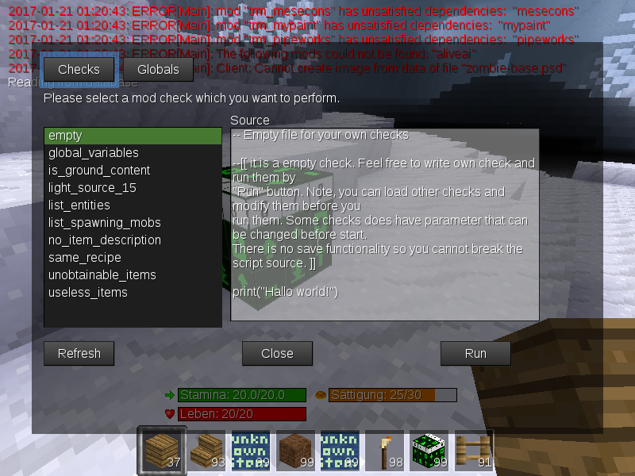
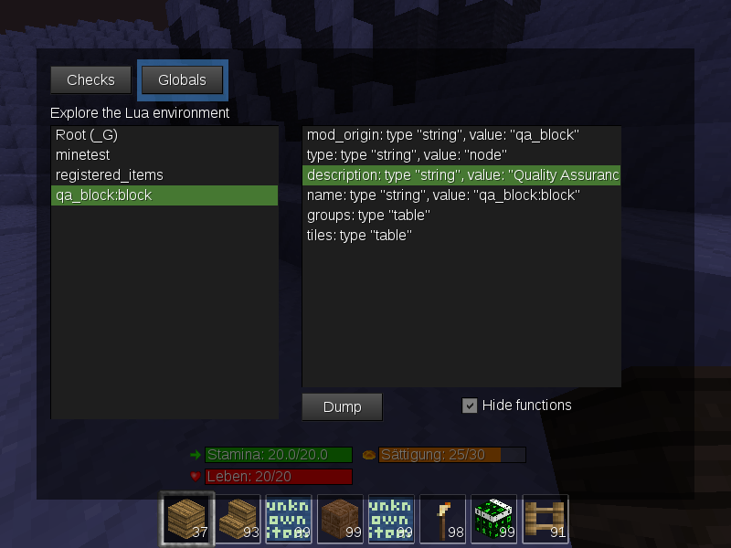

QA Block to run checking scripts for beter quality assurance of code
=======

License GPL-V3: https://www.gnu.org/licenses/gpl-3.0.html

This is a developer helper mod, allow run any lua code for testing reason. The mod can list and run lua-scripts placed in checks subfolder. some check scrips provided.
The second part is able to display global lua-tables tree

# Features
- redirection of print() output to minetest chat. (can be disabled by changing code line "print_to_chat")
- robust call of the scripts trough "pcall" does not crash the game in case of syntax- or runtime errors
- all functionality available trough chat commands and the QA-Block node
- refresh and list the checks script list at runtime
- edit the code before calling them
- type code and run them
- explore global variables/lua tables

https://forum.minetest.net/viewtopic.php?f=11&t=15759

# Dependencies
- none
  - smartfs(provided) - GUI for check selection and manipulation. Optional, but without smartfs there is limited functionality 

# Provided check modules
- empty - Empty file for your own checks
- global_variables - List suspicious global variables
- is_ground_content - This checker lists all nodes for which is_ground_content == true
- light_source_15 - List all nodes for which light_source >= 15
- list_entities - Lists all the registered entities (except builtin)
- list_spawning_mobs - List entities that are mobs from mobs_redo or compatible framework
- no_item_description - Lists all items without description
- same_recipe - Find duplicate crafting recipes
- unobtainable_items - Lists items which seem to be unobtainable
- useless_items - Lists all items which are probably useless

# How to use:
add the mod to the game you like to test

## Using chat command /qa
- /qa help - print available chat commands
- /qa ls - list all available check modules
- /qa set checkname - set default check
- /qa ui - display and run check using the selection dialog. Browse trough globals (smartfs only)
- /qa checkname - run check
- /qa - run default check

## Using the block
1. get the QA-Block from creative inventory
2. place the block somewhere
3a - without smartfs - wait till the default check is finished and the block disappears
3b - with smartfs - start the check using selection dialog

In all cases - check the debug.txt for test results

# Credits
- Wuzzy2 - thanks for ideas, code optimizations and the most check scripts
